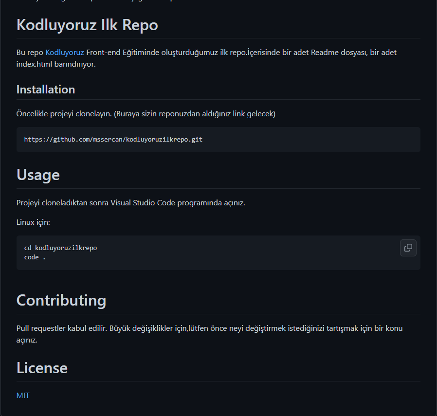

# kodluyoruzilkrepo
Kodluyoruz Eğitimi kapsamında açtığım ilk repo
# Kodluyoruz Ilk Repo

Bu repo [Kodluyoruz](https://app.patika.dev) Front-end Eğitiminde oluşturduğumuz ilk repo.İçerisinde bir adet Readme dosyası, bir adet index.html barındırıyor.

## Installation

Öncelikle projeyi clonelayın. (Buraya sizin reponuzdan aldığınız link gelecek)

```bash
https://github.com/mssercan/kodluyoruzilkrepo.git
```
# Usage 

Projeyi cloneladıktan sonra Visual Studio Code programında açınız.

Linux için:

```linux
cd kodluyoruzilkrepo
code .
```
# Contributing 

Pull requestler kabul edilir. Büyük değişiklikler için,lütfen önce neyi değiştirmek istediğinizi tartışmak için bir konu açınız.

# License

[MIT](https://choosealicense.com/licenses/mit/)

## Projenin resmi 

***

